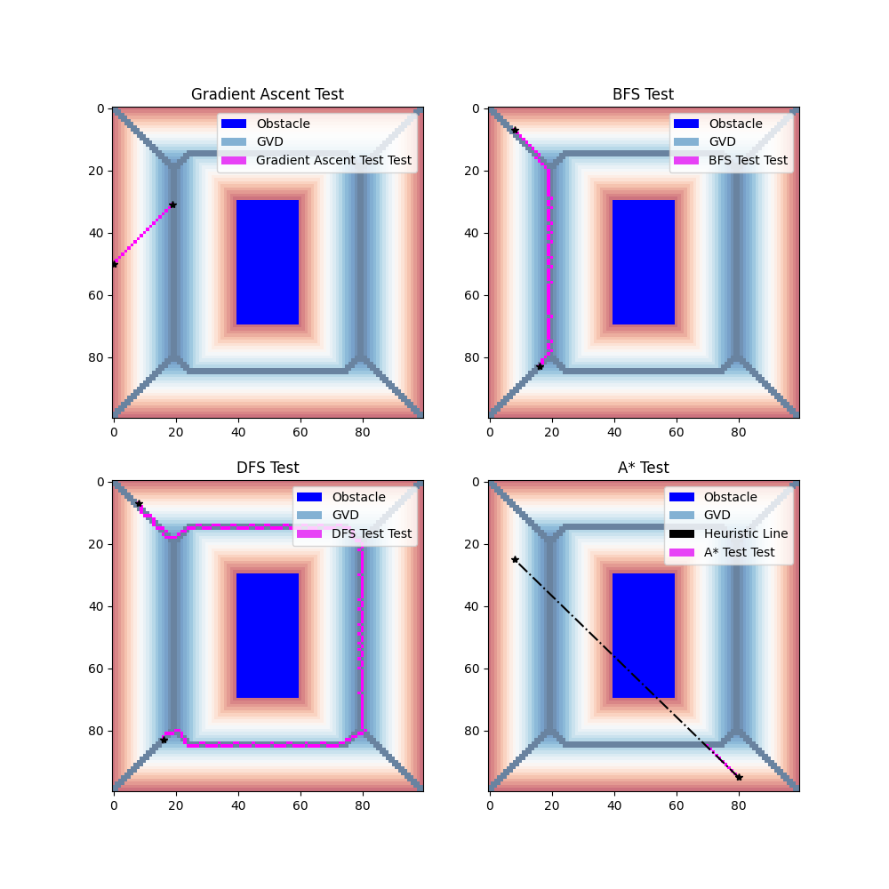

Project overview:
Grid world path planning using search algorithms. 

## Install / Run Instructions

Create and activate a virtual environment for the project (at the project root directory):

```
python3 -m venv .venv
```

To enter the enviroment, please run the following if you are using a Mac

```
source .venv/bin/activate
```

If you are using Windows, please run

```
.venv\scripts\activate.bat
```

Install poetry in your virtual environment.

```
pip install poetry
```

Install all project dependencies

```
poetry install
```

This will set up the packages needed for the project.

You can now modify files in `src/` and run the program at the root directory of the project via

```
poetry run main [directory of the grid world .npy files]
```

## How to Unit Test

### Step 1

Follow the steps above to setup your environment. Make sure all of the dependencies have been installed properly. 


### Step 2

Download a good editor or IDE.


Setup the IDE and open the folder of your grid_world project. The directories should look something like this:


Double-check the following:
- there's a `src` directory that contains the `path_finding.py` script, and utility scripts.
- there's a `worlds` directory that contains the worlds numpy files. 
- there's a `.venv` directory that contains your python virtual environment. 

### Step 3: Unit Testing

Put all the implementation in `path_finding.py`. Once ready to unit test one or multiple methods, run the `unit_tests.py` script as the following:

**Terminal**:


	>> python3 unit_tests.py

### Step 4 Interpreting Results

The unit testing results should look **similar** but not exactly like the following. The script will test BFS, DFS, gradient ascent, and A* separately. 
Recall that DFS is NOT guaranteed to return the optimal path. 


